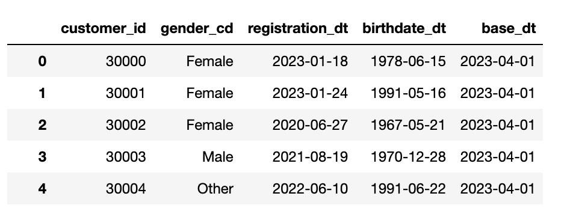
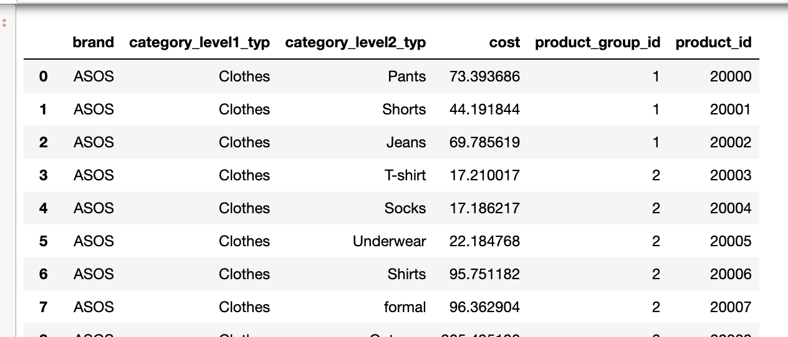
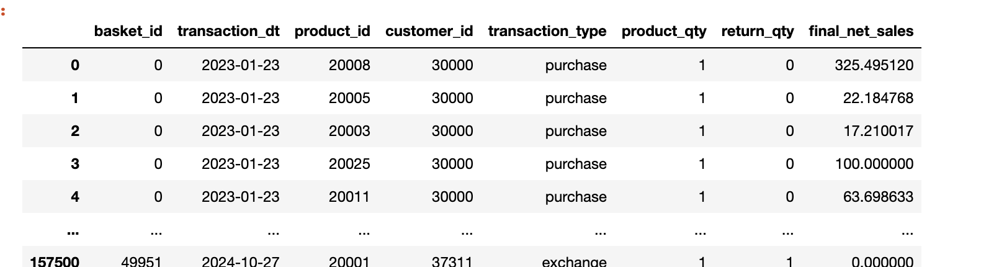

# What it is about

The code generates realistic mock data of purchases/ baskets of customers in retail (for example FMCG, Apparel, Beauty and etc). 

# Description

On opposite to most data mockers that generate tables filled with very random data this code tries to replicate real life customer patterns (described below). This makes output data more plausible when you are showing it in dashboards or you are developing custom reports without real life dataset.

ALl calculations are vectorized, thus code allows to generate millions of customers in the most efficient manner.


Simulated customers behaviour:
- Customers may register, but not purchase anything.
- Customers can register in your system during the first purchase 
- Customers can register, but not transact until next N months. 
- Customers who won't purchase anything in first N months after registration are lost (we don't expect that they will return).
- Customers have a higher than usual probability of not returning after the first purchase. (Buy and Go)
- Purchases are generated in respect to given frequency per year. Thus you can see in the data customers both with high and low frequencies. This periods are generated using exponential distribution for each customer (see link between exponential and poisson distribution).
- Customers are prone to buy items that belongs to specific categories / brands. For example men are more often buying "men clothes" and women - "beauty" products.
- Customers have lifetime and will stop transacting after X months.


# Outputs

Three parquet files generated based on given parameters.

1. Customers Profile


2. Product Catalog


3. Customer Purchases (Baskets and individual transactions)


# How to get outputs
```
python main.py
```